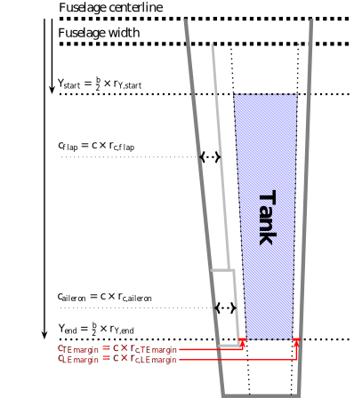
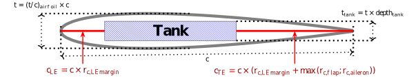
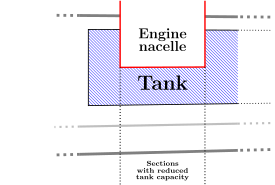

######################
Wing tank volume model
######################

There are several models implemented for the computation of the volume of the tanks inside the wings of the aircraft.

.. contents::

.. _simple-model:

*****************
Simple tank model
*****************

The simple tank volume model is based on the assumption that the tank is a parallelepiped.

The base of the tank is computed by making the assumptions that it stretches from the fuselage centerline to the wing span and that it is located between the 1st and 3rd stringer (respectively located at 30% and 60% of the chord).

The height of the tank is computed using an average wing thickness obtained based on the thickness at the tip and root as well as a penalty factor which results in the following formula :

.. math::
    t_{avg} = 0.7 * \frac{c_{tip} * \left( t/c \right)_{tip} + c_{root} * \left( t/c \right)_{root}}{2}

The volume is then computed with:

.. math::
    \text{MFV} = 0.3 * S_{w} * t_{avg}

Finally the Maximum Fuel Weight (MFW) is computed based on the density of the fuel (which can be either Jet A1 or AvGas).

This model is the one activated by default.

.. _advanced_model

*******************
Advanced tank model
*******************

This model is based on the model presented in :cite:`jenkinson:2003` on page 65.

The wing tank is discretized into sections. The start and end of the tank are defined by a ratio of the wing half-span left as an user input. The areas of the tank cross-sections are then computed at a given number of stations in the spanwise direction and finally integrated to give the tank volume. A top view of the tank is shown in Figure `1`_ .

The width of each section is based on the wing chord minus some space at the leading edge and the trailing edge, highlighted in red in Figures `1`_ and `2`_. The distance between the wing leading edge and the leading edge of the tank is defined by a ratio of the chord (assumed constant at all stations) which is left as a user input. The distance between the trailing edge of the wing and that of the tank is computed accounting for the flaps and the aileron as well as an added margin. The lengths of the flaps and ailerons are computed based on a ratio of the chord also assumed constant regardless of the span. This is illustrated in Figures `1`_ and `2`_.

The height of each section is computed based on the thickness of the wing which is obtained by multiplying the chord with the relative thickness of the airfoil. The tank height is then obtained by multiplying that with a penalty coefficient to account for the depth of the tank. This can be seen in Figure `2`_ which illustrates a cross section of the wing.

Additionally, the influence of the landing gears and engines on the available volume are accounted for. In this model it is represented as a reduced capacity of the tank for stations where there is also the nacelle of the engine or the housing of the landing gear. This is illustrated in Figure `3`_.

This model can be activated by changing the `submodel <https://fast-oad.readthedocs.io/en/stable/documentation/custom_modules/add_submodels.html>`_ used for the computation of the wing tank volume by adding the following line in the submodels section of the `configuration file <https://fast-oad.readthedocs.io/en/stable/documentation/usage.html#fast-oad-configuration-file>`_:

.. code:: yaml

    submodels:
        submodel.geometry.mfw: fastga.submodel.geometry.mfw.advanced